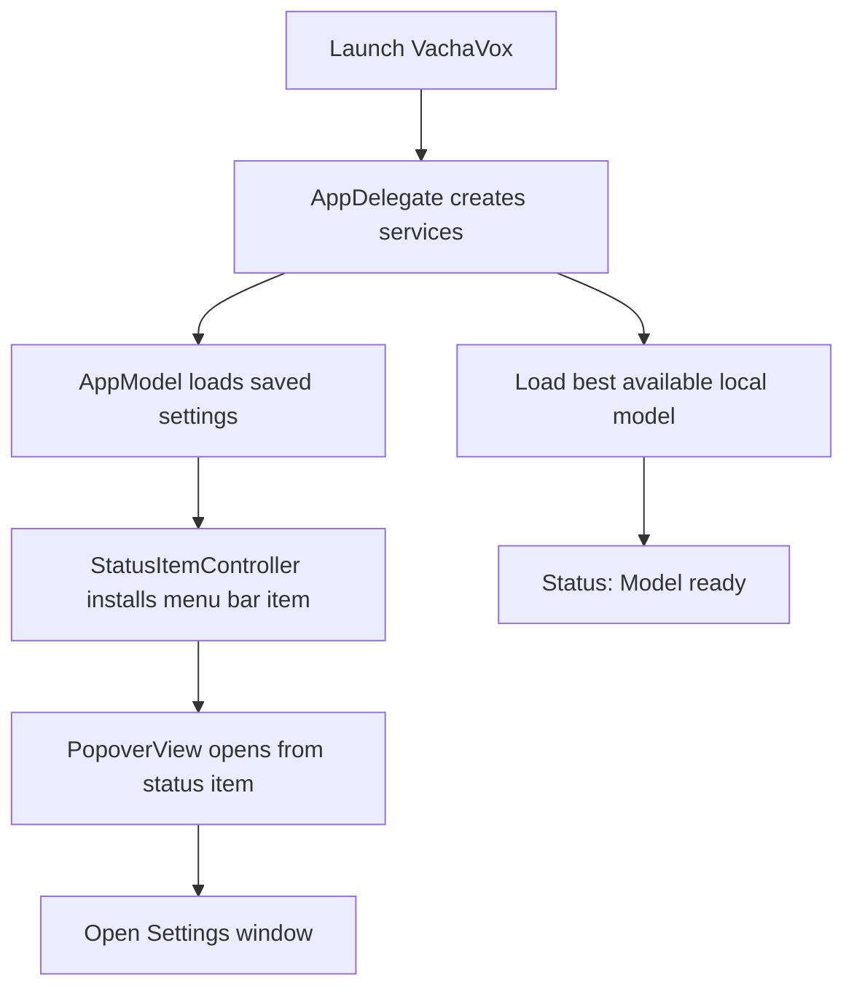
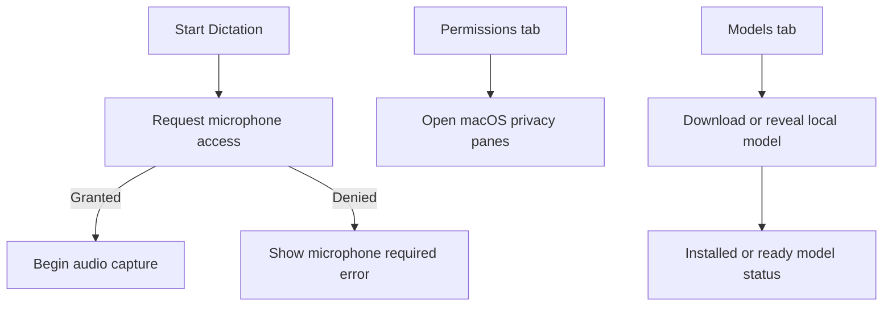
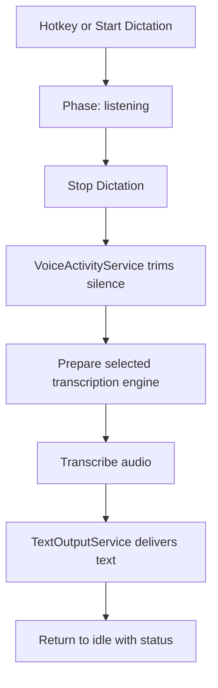
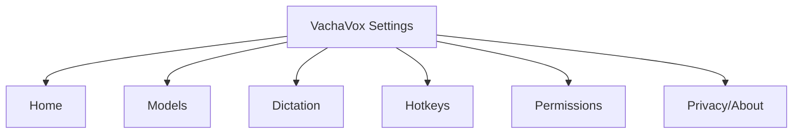
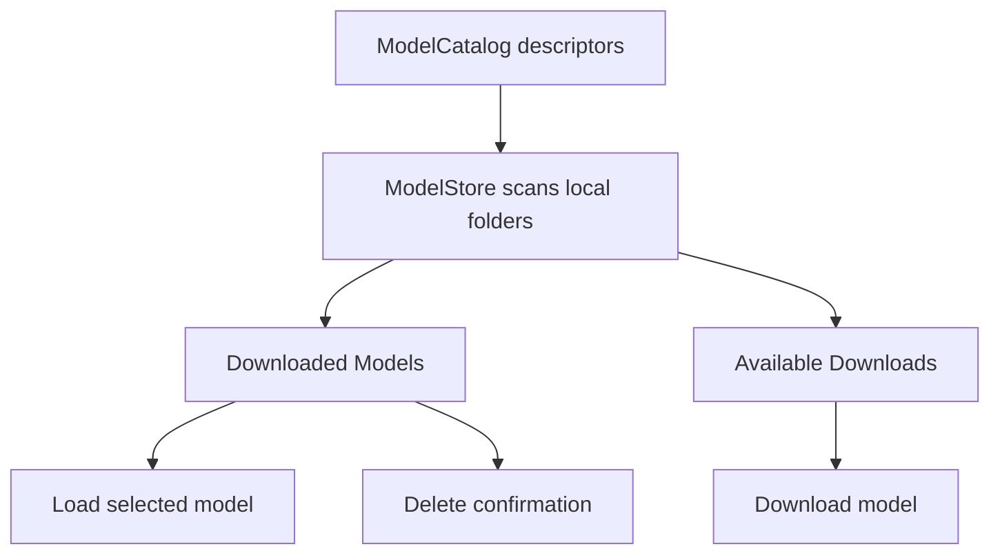
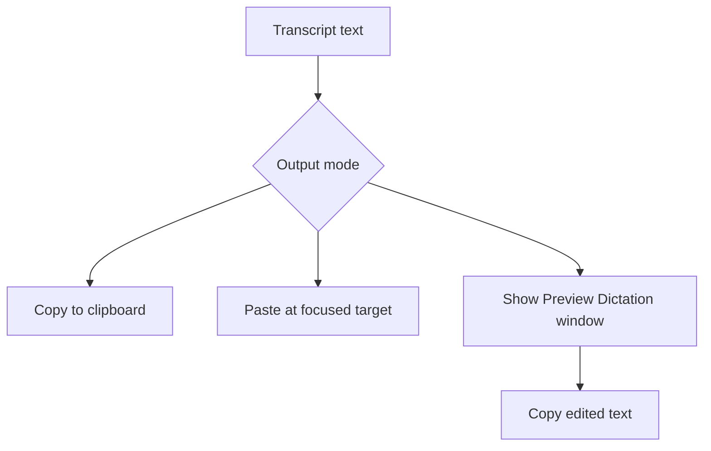

# VachaVox UI Visual Inventory v0.3.1.1

Capture date: 2026-04-27

VachaVox is a local-first macOS menu bar dictation app. It records only while dictation is active, transcribes with local Parakeet or WhisperKit models, and delivers text through Copy, Paste, or Preview output modes. The app surface is intentionally compact: the menu bar popover is the fast path, while Settings handles model management, dictation behavior, hotkeys, permissions, and privacy/about information.

## Visual Inventory

| Screenshot | Surface | State | Related code | Capture notes |
|---|---|---|---|---|
| `00_app-icon-resource.png` | App icon resource | Resource reference | `Sources/VachaVox/Resources/VachaVox.icns` `build/VachaVox.app/Contents/Info.plist` | Static app icon resource converted to PNG with sips. |
| `01_menu-bar-icon-idle.png` | Menu bar | Idle status item | `Sources/VachaVox/MenuBar/StatusItemController.swift` `Sources/VachaVox/Resources/MenuBarIcon.png` | Menu bar crop includes adjacent menu extras because status-item direct click/crop access was limited. |
| `10_settings-home.png` | Settings | Home tab, model ready | `Sources/VachaVox/UI/SettingsView.swift` `Sources/VachaVox/App/DictationCoordinator.swift` | Shows model readiness, primary dictation action, load/refresh controls, and summary rows. |
| `11_settings-models.png` | Settings | Models tab | `Sources/VachaVox/UI/SettingsView.swift` `Sources/VachaVox/Models/ModelCatalog.swift` `Sources/VachaVox/Models/ModelDownloadService.swift` | Shows selected model summary, two installed models, and available downloads. |
| `12_settings-dictation.png` | Settings | Dictation tab | `Sources/VachaVox/UI/SettingsView.swift` `Sources/VachaVox/Settings/AppSettings.swift` | Shows output segmented control, punctuation toggle, silence slider, and performance picker. |
| `13_settings-hotkeys.png` | Settings | Hotkeys tab | `Sources/VachaVox/UI/SettingsView.swift` `Sources/VachaVox/MenuBar/HotKeyService.swift` `Sources/VachaVox/Settings/AppSettings.swift` | Shows push-to-talk mode and Command-Shift-D preset. |
| `14_settings-permissions.png` | Settings | Permissions tab | `Sources/VachaVox/UI/SettingsView.swift` `Sources/VachaVox/Permissions/PermissionsService.swift` `Sources/VachaVox/Utilities/SystemSettingsOpener.swift` | Shows microphone granted, accessibility trusted, privacy settings buttons, and start-at-login toggle. |
| `15_settings-privacy-about.png` | Settings | Privacy/About tab | `Sources/VachaVox/UI/SettingsView.swift` | Shows local privacy promise and dependency/about notes. |
| `16_settings-model-delete-confirmation.png` | Settings | Model delete confirmation | `Sources/VachaVox/UI/SettingsView.swift` `Sources/VachaVox/App/DictationCoordinator.swift` `Sources/VachaVox/Models/ModelCatalog.swift` | Confirmation only; no model folders were deleted. |
| `17_settings-hotkeys-custom-recorder.png` | Settings | Custom shortcut recorder | `Sources/VachaVox/UI/SettingsView.swift` `Sources/VachaVox/MenuBar/HotKeyService.swift` `Sources/VachaVox/Settings/AppSettings.swift` | Shows KeyboardShortcuts recorder field. The preset was restored to Command-Shift-D after capture. |

## Skipped Screenshots

- `02_menu-bar-popover-idle.png`: The LSUIElement status item was visible in the menu bar, but direct status-item activation was blocked from this automation environment after the Settings window was closed.
- `03_menu-bar-popover-paused.png`: Depends on accessing the menu bar popover toggle; skipped for the same status-item activation limitation.
- `04_recording-overlay-listening.png`: The overlay is reachable through Start Dictation, but the only exposed entry point after capture was the inaccessible status item; no permission state was changed to force it.
- `05_recording-overlay-transcribing.png`: Skipped because it depends on a live recording stop/transcription cycle; no synthetic audio or model operation was forced.
- `06_preview-dictation-window.png`: Skipped because Preview output requires completing a dictation flow; no text output state was forced.
- `18_settings-permissions-system-settings-link.png`: Skipped to avoid opening System Settings or changing privacy permission state.
- `19_popover-error-or-missing-model.png`: Skipped because the current environment had a ready installed model; no model folders were moved or removed to create an error.
- `20_popover-last-transcript.png`: Skipped because it requires a completed dictation session and popover access.

## User Flow Overview

### App Launch And Menu Bar Lifecycle

### First-Run Permissions And Model Readiness

### Dictation Flow

### Settings Navigation Flow

### Model Management Flow

### Output Delivery Flow

## Per-Screen Notes

### App Icon Resource

Purpose: Identifies the product in app bundle resources and the Settings/Home header icon.

Entry path/user steps: Bundle resource and Info.plist icon lookup.

Visible controls/options: Large square app icon with VachaVox branding.

Current behavior: Static app icon resource converted to PNG with sips.

Related code files/folders:
- `Sources/VachaVox/Resources/VachaVox.icns`
- `build/VachaVox.app/Contents/Info.plist`

UI rework notes and design-system opportunities: Keep a consistent icon treatment between app icon, menu bar glyph, and in-app brand mark.

### Menu Bar Icon - Idle

Purpose: Provides the always-available entry point for the app.

Entry path/user steps: Run app; inspect macOS menu bar.

Visible controls/options: Template status icon supplied by MenuBarIcon.png while idle.

Current behavior: Menu bar crop includes adjacent menu extras because status-item direct click/crop access was limited.

Related code files/folders:
- `Sources/VachaVox/MenuBar/StatusItemController.swift`
- `Sources/VachaVox/Resources/MenuBarIcon.png`

UI rework notes and design-system opportunities: Status item needs a clearer active/paused/error visual language if more states are added.

### Settings - Home

Purpose: Gives an operational summary and direct model/dictation actions.

Entry path/user steps: Open Settings, select Home.

Visible controls/options: Start Dictation, Load Model, Refresh Models, selected model, engine, output, hotkey, status.

Current behavior: Shows model readiness, primary dictation action, load/refresh controls, and summary rows.

Related code files/folders:
- `Sources/VachaVox/UI/SettingsView.swift`
- `Sources/VachaVox/App/DictationCoordinator.swift`

UI rework notes and design-system opportunities: Home works as a dashboard but could use stronger grouping for readiness, action, and configuration summary.

### Settings - Models

Purpose: Centralizes local model status and model operations.

Entry path/user steps: Open Settings, select Models.

Visible controls/options: Selected model summary, downloaded models, available downloads, status badges, select/load/delete/reveal/source actions.

Current behavior: Shows selected model summary, two installed models, and available downloads.

Related code files/folders:
- `Sources/VachaVox/UI/SettingsView.swift`
- `Sources/VachaVox/Models/ModelCatalog.swift`
- `Sources/VachaVox/Models/ModelDownloadService.swift`

UI rework notes and design-system opportunities: Model cards are functional but dense; actions could be grouped by primary, file management, and external source.

### Settings - Dictation

Purpose: Controls output delivery and transcription behavior.

Entry path/user steps: Open Settings, select Dictation.

Visible controls/options: Output segmented control, punctuation toggle, silence sensitivity slider, performance picker.

Current behavior: Shows output segmented control, punctuation toggle, silence slider, and performance picker.

Related code files/folders:
- `Sources/VachaVox/UI/SettingsView.swift`
- `Sources/VachaVox/Settings/AppSettings.swift`

UI rework notes and design-system opportunities: Add short but compact labels for sensitivity/performance consequences if redesign has room.

### Settings - Hotkeys

Purpose: Controls trigger behavior and shortcut preset.

Entry path/user steps: Open Settings, select Hotkeys.

Visible controls/options: Mode segmented control, preset picker, implementation note.

Current behavior: Shows push-to-talk mode and Command-Shift-D preset.

Related code files/folders:
- `Sources/VachaVox/UI/SettingsView.swift`
- `Sources/VachaVox/MenuBar/HotKeyService.swift`
- `Sources/VachaVox/Settings/AppSettings.swift`

UI rework notes and design-system opportunities: The low-level Fn note is useful but visually quiet; redesign could make shortcut mode and preset easier to scan.

### Settings - Permissions

Purpose: Shows privacy permission readiness and links to macOS privacy panes.

Entry path/user steps: Open Settings, select Permissions.

Visible controls/options: Microphone status, accessibility status, settings buttons, start-at-login toggle.

Current behavior: Shows microphone granted, accessibility trusted, privacy settings buttons, and start-at-login toggle.

Related code files/folders:
- `Sources/VachaVox/UI/SettingsView.swift`
- `Sources/VachaVox/Permissions/PermissionsService.swift`
- `Sources/VachaVox/Utilities/SystemSettingsOpener.swift`

UI rework notes and design-system opportunities: Permission status could use badges and remediation language for denied/not trusted states.

### Settings - Privacy/About

Purpose: States local processing and dependency/about information.

Entry path/user steps: Open Settings, select Privacy/About.

Visible controls/options: Local privacy promise and dependency list.

Current behavior: Shows local privacy promise and dependency/about notes.

Related code files/folders:
- `Sources/VachaVox/UI/SettingsView.swift`

UI rework notes and design-system opportunities: This tab is sparse; could combine privacy assurance, version, licenses, and diagnostics in a structured layout.

### Settings - Delete Confirmation

Purpose: Protects local model folders from accidental deletion.

Entry path/user steps: Models tab, Delete on Whisper Small, then Cancel.

Visible controls/options: Confirmation dialog with destructive action and target folder path.

Current behavior: Confirmation only; no model folders were deleted.

Related code files/folders:
- `Sources/VachaVox/UI/SettingsView.swift`
- `Sources/VachaVox/App/DictationCoordinator.swift`
- `Sources/VachaVox/Models/ModelCatalog.swift`

UI rework notes and design-system opportunities: Long paths wrap heavily; redesign could separate model name, impact, and path in clearer rows.

### Settings - Custom Shortcut Recorder

Purpose: Shows the custom shortcut capture state.

Entry path/user steps: Hotkeys tab, choose Custom shortcut.

Visible controls/options: KeyboardShortcuts recorder with existing shortcut and clear control.

Current behavior: Shows KeyboardShortcuts recorder field. The preset was restored to Command-Shift-D after capture.

Related code files/folders:
- `Sources/VachaVox/UI/SettingsView.swift`
- `Sources/VachaVox/MenuBar/HotKeyService.swift`
- `Sources/VachaVox/Settings/AppSettings.swift`

UI rework notes and design-system opportunities: Recorder fits the panel, but current shortcut inheritance should be clearer during preset switching.

## Code Mapping Notes

- `SettingsView.swift`: Defines NavigationSplitView sidebar tabs, settings panels, model cards, status badges, confirmation dialog, permissions pane, and SettingsWindowController.
- `PopoverView.swift`: Defines compact menu bar surface with app header, level meter, primary Start/Stop button, readiness rows, transcript card, Paused toggle, Settings, and Quit actions.
- `RecordingOverlayWindowController.swift`: Defines transient floating NSPanel for listening/transcribing states and positions it near the focused caret or mouse.
- `PreviewWindowController.swift`: Defines editable Preview Dictation window with TextEditor, Cancel, and Copy accept action.
- `AppSettings.swift`: Stores selected engine/model, hotkey mode and preset, output mode, punctuation, silence sensitivity, performance mode, launch-at-login, paused state, and hotkey description.
- `DictationCoordinator.swift`: Owns dictation state transitions, permission checks, recording start/stop, local transcription, output delivery, model load/download/delete/reveal, and status updates.
- `ModelCatalog.swift`: Defines Parakeet and WhisperKit model metadata, validation, default model, priority order, local model paths, and status labels.

## UI Rework Checklist

- Navigation hierarchy: decide whether Home is a dashboard, setup checklist, or status summary.
- Control consistency: align segmented controls, pop-up buttons, toggles, and destructive actions with a predictable settings grammar.
- Status/state language: normalize Ready, Installed, Missing, Loading, Downloading, Paused, and error messaging across popover and Settings.
- Empty/error/loading states: design explicit missing-model, permission-denied, loading-model, and failed-transcription states.
- Model management density: separate model identity, status, file path, and operations so dense cards remain scannable.
- Permission guidance: add concise remediation for microphone/accessibility when not granted.
- Accessibility and keyboard behavior: verify sidebar navigation, shortcut recorder focus, destructive confirmation, and VoiceOver labels.
- Visual design tokens: define spacing, typography, radius, color, icons, and status badges shared by popover, settings cards, and overlays.
