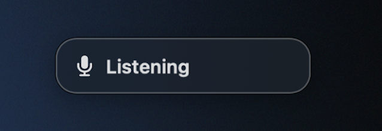
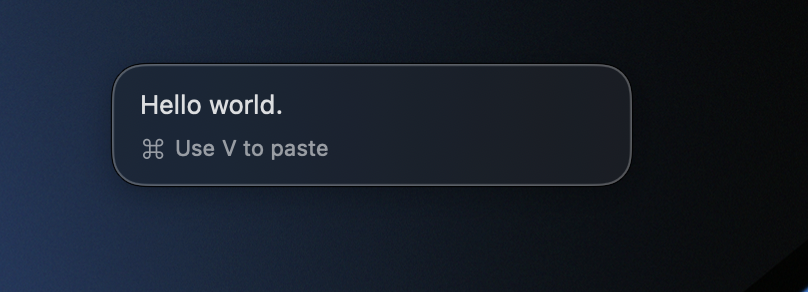
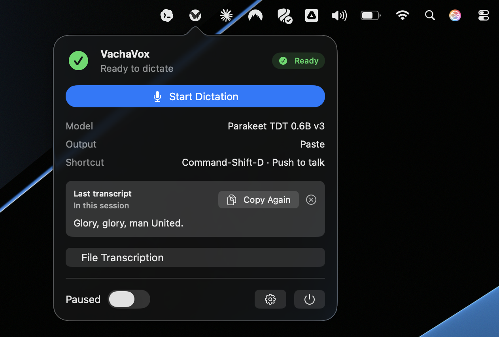

<p align="center">
  
</p>

<h1 align="center">VachaVox</h1>

<p align="center">Local-first voice dictation for macOS. Hold a key, speak, and your words appear where your cursor is — no cloud, no subscription.</p>

<p align="center">
  <a href="https://github.com/anujraja404/vachavox/actions/workflows/ci.yml"></a>
</p>

<p align="center">
  <a href="https://github.com/anujraja404/vachavox/releases/download/v0.6.3/VachaVox-v0.6.3-B23.zip">⬇ Download v0.6.3 for macOS</a>
  &nbsp;·&nbsp;
  <a href="Docs/privacy.md">Privacy</a>
  &nbsp;·&nbsp;
  <a href="CHANGELOG.md">Changelog</a>
</p>


<p align="center">
  <h3 align="center">VachaVox Landing Page</h3>
  <a href="[https://github.com/anujraja404/vachavox/actions/workflows/ci.yml](https://anujraja.com/VachaVox/)"></a>
</p>

---

## Screenshots

<table>
  <tr>
    <td align="center"><br/><sub>Hold trigger — listening starts</sub></td>
    <td align="center"><br/><sub>Transcript auto-pasted where your cursor is (Cmd+V if not)</sub></td>
    <td align="center"><br/><sub>Menu bar popover</sub></td>
  </tr>
</table>

## What it does

VachaVox is a macOS menu bar app that transcribes your speech using a local Core ML model — nothing leaves your machine. Hold Fn (or a custom hotkey), speak, and VachaVox pastes the transcribed text directly into whatever app you're using. It supports Parakeet and Whisper-family models, works without Accessibility permission in Copy/Preview modes, and also transcribes audio files to Markdown.

## Requirements

- macOS 14.0 or later
- A local Core ML voice model — see [Model Installation](Docs/model-installation.md)

## Quick Start

1. Download the app from the link above, open it, and grant Microphone access when prompted
2. Install a voice model using [Docs/model-installation.md](Docs/model-installation.md)
3. Open Settings > Models, select and load your model
4. Hold Fn to dictate — VachaVox pastes the result into the frontmost app (grant Accessibility for paste mode)

## Building from Source

Requires Swift 5.10+ (ships with Xcode 15.3+).

```bash
swift build                   # compile
swift test                    # run tests
Scripts/package_app.sh        # create build/VachaVox.app
```

Voice models are not bundled — download them separately after building. See [Docs/model-installation.md](Docs/model-installation.md).

## Status & Roadmap

**Current status:** VachaVox v0.6.3 is stable and working exactly as intended for daily personal use. I dictate into it every day — it does its job quietly and stays out of the way.

**Bug reports:** I'm not actively hunting for bugs, but if you hit something reproducible, [open an issue](https://github.com/anujraja404/vachavox/issues) and I'll take a look. Clear steps to reproduce go a long way.

**Future plans:** A few things are in the pipeline — no ETAs, no promises. The one I'm most interested in is **refining transcribed text** (light post-processing to clean up filler words and punctuation before paste). Other ideas exist. Not feature-maxing. This app does one thing well and I'd like to keep it that way.

**Using this app? Have a feature idea?** [Open an issue](https://github.com/anujraja404/vachavox/issues) or reach out — I'd genuinely love to hear how you're using it and what you're thinking.

## Documentation

- [Model Installation](Docs/model-installation.md)
- [Model Sources](Docs/model-sources.md)
- [Troubleshooting](Docs/troubleshooting.md)
- [Privacy](Docs/privacy.md)
- [Contributing](CONTRIBUTING.md)

## License

Vachavox is licensed under the MIT License with a Commons Clause.

**Free for:**
- Personal, non-commercial use
- Research and education
- Internal business use (not resold)
- Open-source projects (as long as you don't monetize them)

**Requires a commercial license for:**
- SaaS offerings
- Hosted services
- Selling products/services built on Vachavox
- Any commercial resale

For commercial licensing inquiries, contact: [anujrajaceo@gmail.com](mailto:anujrajaceo@gmail.com) or visit [anujraja.com](https://anujraja.com)

Built on [FluidAudio](https://github.com/FluidInference/FluidAudio), [WhisperKit](https://github.com/argmaxinc/WhisperKit), and [KeyboardShortcuts](https://github.com/sindresorhus/KeyboardShortcuts).
